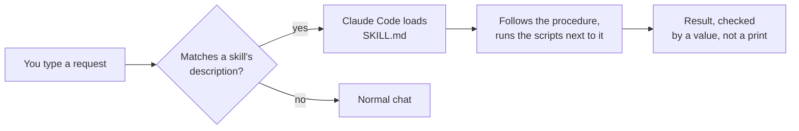

# claude-code-skills

Nine Claude Code skills I use on my own machines, cleaned up so you can drop them into `~/.claude/skills/`.

> **Status: work in progress.** I use these day to day on my own setup; the public copies are scrubbed and generalised, and some scripts here have not been run since that rewrite (see "What was checked" below).

## Why skills matter

A skill is a folder with a `SKILL.md` file. Its `description` lists the phrases that should trigger it. When you type something that matches, Claude Code loads the procedure on its own, so you do not have to remember to paste instructions.

That is what makes them worth writing. A lesson learned the hard way in one session (a checker that lies when throttled, a sed regex that silently matches nothing) is gone when the chat ends. Written into a skill, it comes back the next time the same job starts. Every skill here keeps the failures that shaped it, because a rule without the cost it prevented tends to get "simplified" away later.

## The skills

| Skill | What it does | What it needs | Why I built it |
|---|---|---|---|
| [handoff](skills/handoff/) | Rolls a long chat into a new numbered session. Lessons go to skills, memory and `CLAUDE.md`; only in-flight state goes to a 200-line state file. Then it closes and reopens the chat in the same terminal. | Linux with `systemd --user`, bash, the included `claude()` wrapper | Long chats that compacted kept the story and lost the numbers. |
| [branch](skills/branch/) | Splits a side topic into its own new chat with its own short handoff, and opens it in a new kitty tab. | `handoff`, kitty with remote control on | My chats kept drifting into a second project halfway through. |
| [ate](skills/ate/) | Logs food to a FatSecret diary from a sentence like "two eggs and a whopper jr", and shows the day's totals. | FatSecret account + Platform API app (Premier Free tier), Python 3 | Typing a sentence is faster than searching the app for every item. |
| [rsvp](skills/rsvp/) | Accepts or declines a calendar invite from the exact address that was invited, by sending a standard iTIP reply over IMAP/SMTP. | IMAP + SMTP access to that mailbox, Python 3 | My custom-domain mail forwards to Gmail, and Gmail's RSVP buttons answered as the Gmail address, so Outlook organisers saw no response. |
| [domainhunt](skills/domainhunt/) | Checks domain availability and sweeps thousands of names, with self-tests before and after every batch so a throttled checker can't fake "available". | bash, curl, dig, python3 | Hunting a product name, a throttled sweep reported thousands of free names that were not free. |
| [sniff](skills/sniff/) | Shows the decrypted HTTP(S) requests an Android app sends, using mitmproxy and an Android 14+ system-store CA injection. | Rooted Android, adb or ssh into Termux, mitmproxy | I wanted to see what an app was actually calling, and the old CA install method stopped working on Android 14. |
| [pinetboot](skills/pinetboot/) | Reflashes a Raspberry Pi's SD card with no card reader: netboots the Pi from a clone of its own system, then writes the card through a gated script. | Pi 4-class board, a Linux box on the same LAN with dnsmasq + NFS + ufw | There is no card reader in my house. |
| [diskinstall](skills/diskinstall/) | Dual-boots Debian onto a Windows machine with no USB stick, mostly over ssh, then sets up KDE Plasma remotely. | UEFI Windows box with OpenSSH Server, a person at its screen for the installer | I had no USB stick and wanted Debian on a Windows tablet. |
| [sshhost](skills/sshhost/) | Makes a new box reachable as `ssh <name>`, including by bare IP, and tests it with key-only auth. | OpenSSH client and an ed25519 key | A strict `Host *` block made new boxes fail with `Permission denied (publickey)`. |

Each `SKILL.md` starts with a two-line comment saying what it needs.

## How it works



Skills are plain Markdown plus small scripts. There is no server and nothing to build. The scripts are bash or Python 3 standard library, except where a skill needs an outside tool (mitmproxy, dnsmasq, kitty).

A few habits run through all of them:

- **Gate on a value, never on a printed message.** A check that only prints is not a check.
- **Prove the instrument with a known positive** before trusting what it says (`domainhunt` tests `google.com` before and after every batch).
- **Outward actions need an explicit yes.** `rsvp` will not send without `--yes`, and `domainhunt` never buys.
- **Secrets never reach the chat.** Scripts read credentials from the environment or a 600-mode file, and re-raise library errors by exception type only, because an exception message can carry a password.

## Some numbers from the skill files

These are the measurements recorded in the skills themselves, with their context. I did not re-run any of them for this repo.

- `domainhunt`: after a WHOIS check ran alongside a large `dig` sweep, a 40-name random sample of names it called free was 40 of 40 actually registered. One later sweep of 3-word names found 944 of 1,243 free (2026-09-25). The whole hunt covered about 52,000 names over 18 sweeps.
- `sniff`: injecting the CA over ssh took about 48 s on one Android 16 phone (2026-09-16), because it re-binds every app's mount namespace.
- `diskinstall`: on the test tablet, 89.7 GB free on C: allowed only 57.7 GB to be shrunk (September 2026).
- `handoff`: 13 of 17 open chats came back without Remote Control after a wrapper change shipped without bumping its version tag (2026-09-30). That is why `exit.sh` now checks the tag.

## Install

1. Install Claude Code.
2. Copy the skill folders you want into your skills directory:
   ```bash
   git clone <this repo> claude-code-skills
   mkdir -p ~/.claude/skills
   cp -r claude-code-skills/skills/domainhunt ~/.claude/skills/
   ```
   Copy only what you will use; every skill's description is read at the start of each session.
3. Read the two-line header at the top of the skill's `SKILL.md` and set up what it lists.
4. Start a new Claude Code session. Type something from the skill's description, or `/<skill-name>`.

Per-skill setup:

- **handoff**: add `source ~/.claude/skills/handoff/claude-wrapper.bash` to `~/.bashrc`, open a new terminal. Optional: `export CLAUDE_HANDOFF_RC=1` to bring Remote Control back on each rollover.
- **branch**: needs `handoff`; in `kitty.conf` set `allow_remote_control yes`.
- **ate**: put `FATSECRET_CONSUMER_KEY` and `FATSECRET_CONSUMER_SECRET` (the OAuth 1.0 secret) in your environment or `~/.config/fatsecret.env`, then run `python3 ~/.claude/skills/ate/fs_auth.py` once in a terminal.
- **rsvp**: put `INVITE_REPLY_USER`, `INVITE_REPLY_PASS`, `INVITE_REPLY_IMAP`, `INVITE_REPLY_SMTP` and `INVITE_REPLY_NAME` in your environment or `~/.config/invite-reply.env` (mode 600).
- **sniff**: `pipx install mitmproxy`, run `mitmdump` once to generate its CA, and set `PHONE_SSH_HOST` if your ssh alias for the phone is not `phone`.
- **pinetboot**: write `~/.config/pi-netboot/<host>.conf` as described at the top of `pi_netboot.sh`. Set `SUDO="sudo -A"` if you use an askpass helper.
- **diskinstall**: edit the `EDIT ME` block at the top of every `.ps1`, and the hostname, user and public key in `preseed.cfg`.

## Running it

You don't run the skills directly; you ask Claude. For example: "is myproductname.com free?", "I ate two slices of pepperoni pizza", "accept the Tuesday invite", "reflash the pi", "sniff what this app calls". The scripts also work by hand; each has usage at the top or a `--help`.

## What was checked for this repo

- `bash -n` passes on every shell script, and `python3 -m py_compile` on every Python file.
- `--help` / `help` output works for `fs_log.py`, `invite_reply.py` and `phone_mitm.sh`.
- A secret and personal-data scanner reports 0 hits on the tree.

Not run after the rewrite, because each one touches a network service, a device, a calendar, a mailbox or a live session: the FatSecret calls, the invite sender, the domain checkers, the phone proxy, the Pi netboot rig and `flasher.sh` (which is new in this repo and has never been executed), the PowerShell scripts (no PowerShell parser was available here, so they are not even syntax-checked), `exit.sh` and `branch-launch.sh`.

## Not included, and why

- **My other skills.** More than thirty others are tied to my own network, devices, accounts or separate projects, so they would not work anywhere else.
- **Personal data.** The food ledger that `ate` builds, every credential, my hosts and addresses.
- **Third-party files.** No Debian installer images, firmware or mitmproxy certificates. `diskinstall` says where to download the Debian netboot files; `sniff` generates its own CA on your machine.

## Built with Claude Code

These skills were written and refined with Claude Code over many sessions on my own machines, and this public copy was scrubbed and generalised from the originals by Claude Code.

## License

MIT. See [LICENSE](LICENSE).
